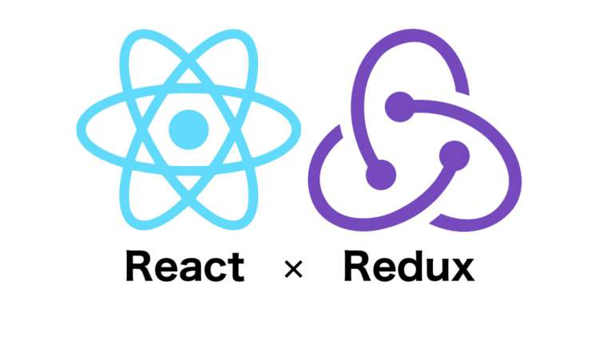

#Redux

##Flux,Redux,React-redux概念
>严格意义上来说，React 只是MVC架构中的View层，并不是 Web 应用的完整解决方案，因此，只用 React 没法实现大型应用。为了解决这个问题，2014年 Facebook 提出了 Flux 架构的概念，并在2015年推出Redux，将 Flux 与函数式编程结合一起，在很短时间内就成为了最热门的前端架构。

* **什么是Redux**：Redux 是一种新型的前端“架构模式”（Flux 架构的一种变种），它不关注你到底用什么库，你可以把它应用到 React 和 Vue，甚至跟 jQuery 结合都没有问题。

* **React和Redux**：事实上是两个独立的产品，项目中可以使用 React 而不使用
Redux ，也可以使用 Redux 而不使用 React 

* **什么是React-redux**：就是把 Redux 这种架构模式和 React.js 结合起来的一个库，是 Redux 架构在 React.js 中的体现，利用这个库能够大大简化代码的书写

##什么时候需要Redux
>Redux作者：如果你不知道是否需要 Redux，那就是不需要它，只有遇到 React 实在解决不了的问题，你才需要 Redux

* 某个组件的状态，需要共享
* 某个状态需要在任何地方都可以拿到
* 在一个组件中需要改变全局状态
* 在一个组件中需要改变另一个组件的状态

##Redux 的工作流程


##基本概念
###核心对象：Store
>store是Redux存储区（一个保存数据的地方），你可以把它看成一个仓库，规定一个应用只能有一个Store，store中的数据可以被直接访问，但只能通过提供的reducer进行更新。

* 生成数据仓库方法：createStore() 
```javascript
    import { createStore } from 'redux';
    const store = createStore(reducer);//reducer为一个纯函数，用于设定state修改逻辑（如何修改state中的数据）
```
* 常用方法
    * getState() 获取仓库最新状态（数据）
    * dispatch(action) 操作数据
    * subscribe(fn) 监听数据修改

###数据存储：State
>state为数据状态（快照，即数据在某个时间点的状态），State改变则View改变

```js
    store.getState();//获取某一个数据状态（对store生成快照）
```

###状态更新提交：Dispatch
>修改数据操作

```js
    store.dispatch(action);//是 View 发出 Action 的唯一方法
```

###状态更新提交参数：Action
>Action用于定义如何改变state，是用户改变 State 的唯一方式，

* 格式：`{type:'UPDATE_CART',payload}`
    * type: 一个简单的字符串常量，例如ADD, UPDATE, DELETE等。
    * payload: 用于更新状态的数据。
* 使用方式：
```js
    store.dispatch({type:'UPDATE_CART',{num:100});
```

###Action Creator
>每次编写action对象比较麻烦，可以封装一个函数用于生成action

```js
    export function updateCart(todo){
        return {
            type:'UPDATE_CART',
            payload:todo
        }
    }
```

###状态更新逻辑：Reducer
Reducer 必须是一个**纯函数**，用于指定state修改逻辑，它接受当前 state 和 action 作为参数，并根据state和action的值返回新的state
>纯函数：返回结果由参数来决定，不对参数做修改操作，不产生任何副作用

```js
    //设置默认值
    let defaultState = {goodslist:[],step:0}
    let cartReducer = (state=defaultState,action)=>{
        switch(action.type){
            case 'UPDATE_CART';
                return {...state,goodslist:action.payload}

            default:
                return state;
        }
        
    }
```
####处理多个Reducer：combineReducers
```js
    import { createStore,combineReducers } from "redux";
    const productsReducer = function(state=[], action) {
      return state;
    }
    //合并Reducer
    const allReducers = {
      products: productsReducer,
      shoppingCart: cartReducer
    }

    const rootReducer = combineReducers(allReducers);
    let store = createStore(rootReducer);
```


#React-Redux


为了方便使用，Redux 的作者封装了一个 React 专用的库 React-Redux，它提供了一些接口，用于Redux的状态和React的组件展示结合起来，以用于实现状态与视图的一一对应

##组件分类
根据功能不同，React-Redux 将所有组件分成两大类:

####1）UI 组件
职责简单，只负责 UI 的呈现，内容只依赖props
####2）容器组件
负责管理数据和逻辑，并把数据通过prop传入UI组件

>React-Redux 规定，所有的 UI 组件都由用户提供，容器组件则是由 React-Redux 自动生成


##connect()
>React-Redux 提供connect方法，用于从 UI 组件生成容器组件。connect的意思，就是将这两种组件连起来


connect方法接受两个参数(Function类型)，用于定义了 UI 组件的业务逻辑：

###mapStateToProps
>顾名思义，将state中的数据映射到UI组件的props，
* 特点：每当state更新的时候，就会自动执行，重新计算 UI 组件的参数，从而触发 UI 组件的重新渲染

* 负责组件的输入逻辑，即将state映射到 UI 组件的参数(props)
* 必须返回一个对象

###mapDispatchToProps
* 负责组件的输出逻辑，即将用户对 UI 组件的操作映射成 Action
* 必须返回一个对象

```js
    function mapStateToProps(state) {
      return {
        data: state.shoppingCart.goodslist//将state中购物车页面的goodslist数据映射到props，Cart组件中通过props.data访问
      }
    }
    function mapDispatchToProps(dispatch) {
      return {
        onChangeQty: (action) => dispatch(action),
        onRemoveGoods: (action) => dispatch(action),
      }
    }
    Cart = connect(mapStateToProps,mapDispatchToProps)(Cart);
```


##组件`<Provider>` 
React-Redux 提供Provider组件，结合`connect`方法可以让容器组件拿到state
